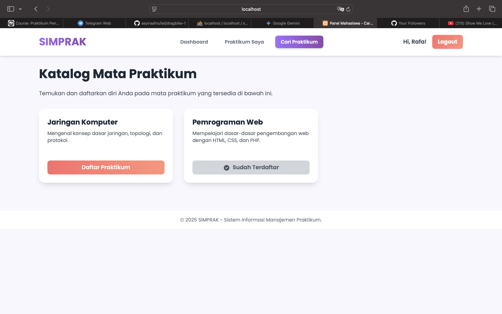
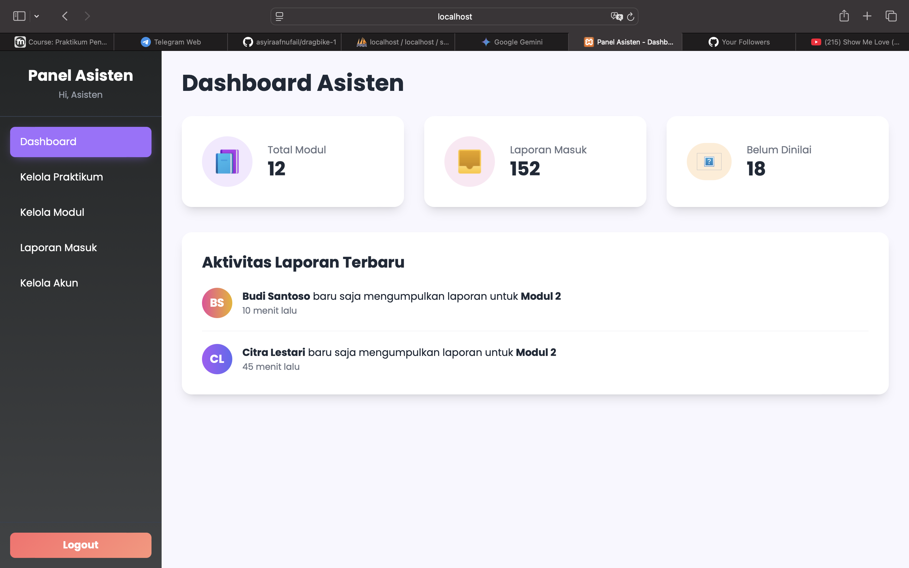
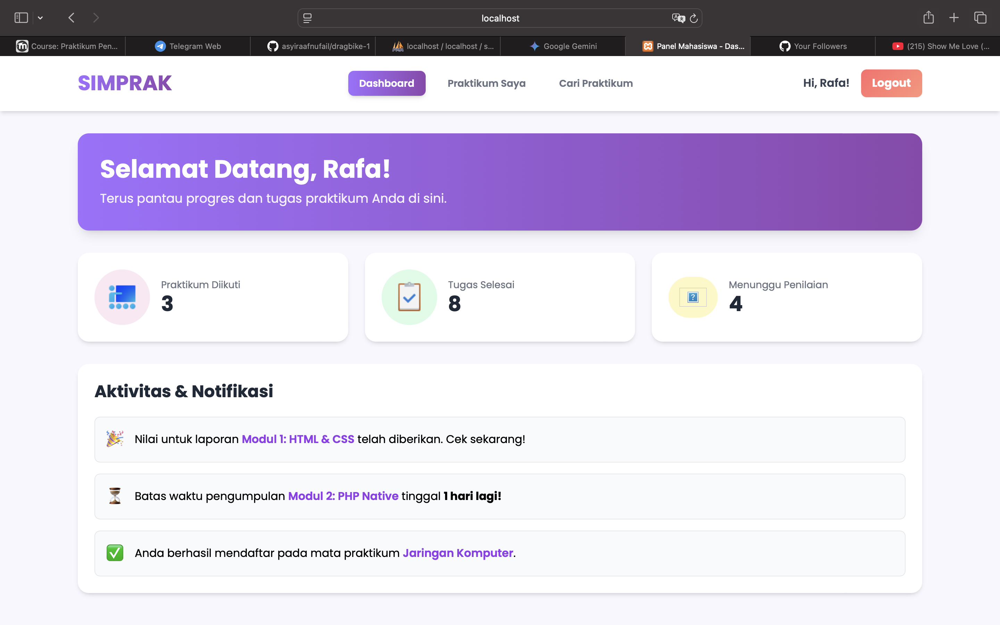
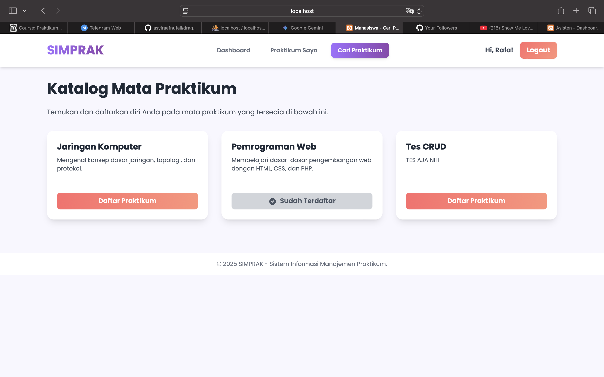
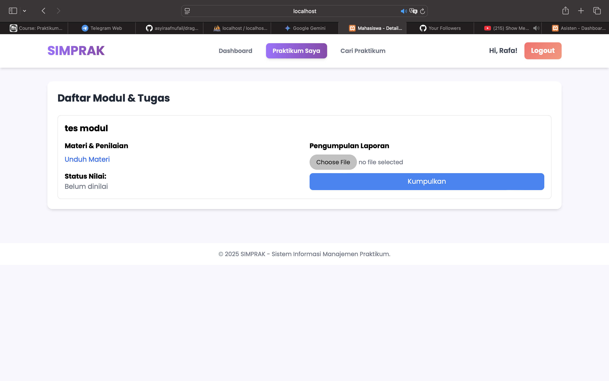
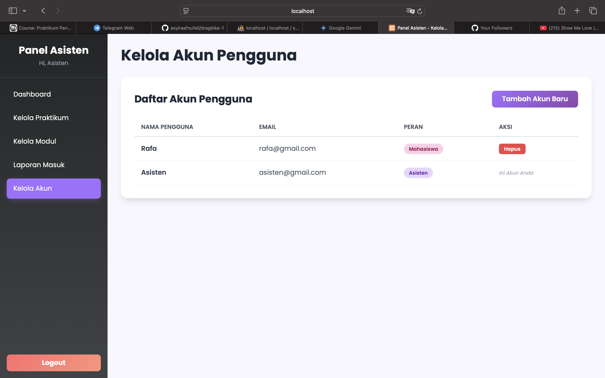
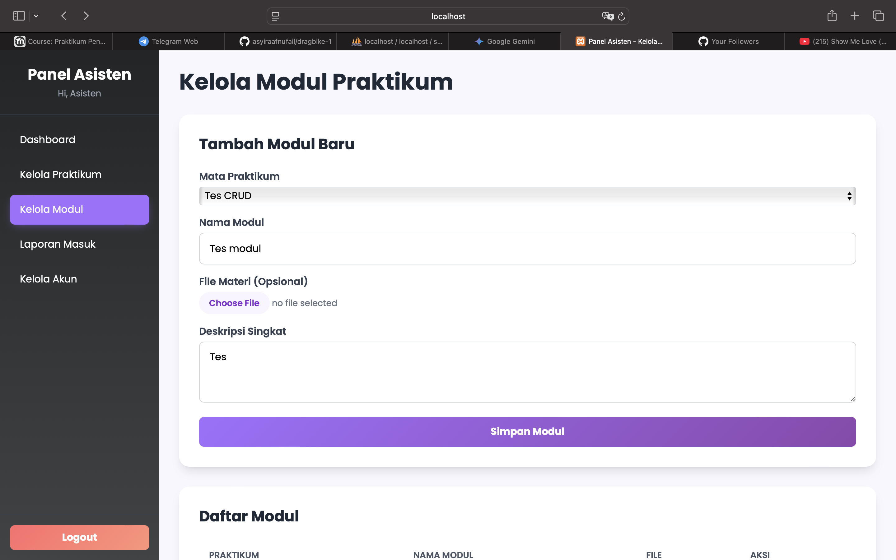
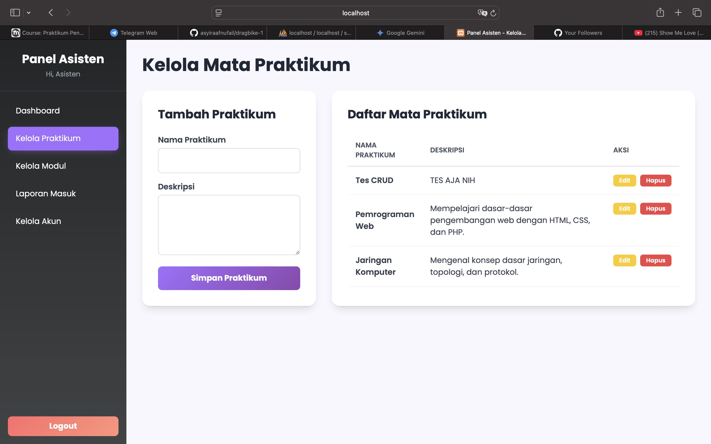
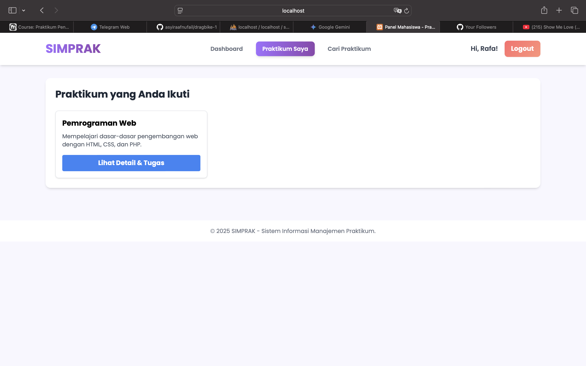
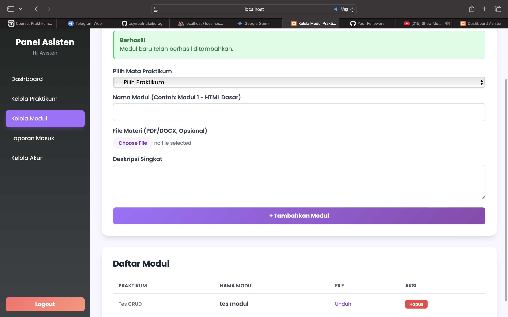

# SIMPRAK - Sistem Informasi Manajemen Praktikum

SIMPRAK adalah aplikasi web berbasis PHP Native yang dirancang untuk memfasilitasi manajemen kegiatan praktikum antara Asisten dan Mahasiswa.

## Fitur Utama
- Pendaftaran Mahasiswa & Asisten
- Manajemen Mata Praktikum (CRUD oleh Asisten)
- Manajemen Modul & Upload Materi
- Pengumpulan Laporan oleh Mahasiswa
- Penilaian Laporan oleh Asisten

## Tampilan Aplikasi

          

--- 

### Cara Instalasi
1.  Clone repository ini.
2.  Impor file `database.sql` ke dalam database MySQL Anda.
3.  Sesuaikan koneksi database di file `config.php`.
4.  Jalankan aplikasi.